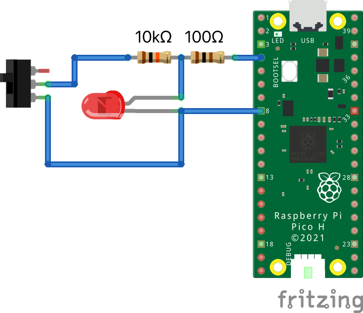
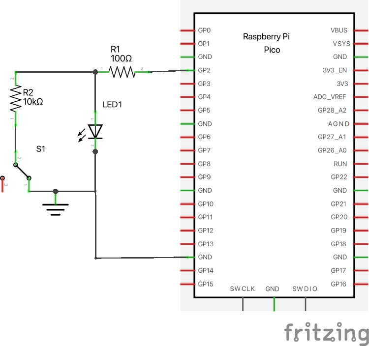

Demo using a single pin to read a switch and to control an LED.
This can be particularly useful for saving I/O and reducing the amount of wire/cabling required for panel-mounted elements.
Requires a 10kΩ resistor for the switch, in addition to the LED's current limiting resistor.

# Usage

<p align="center">
  
&nbsp; &nbsp; &nbsp; &nbsp;
  
</p>

This demo uses belay for package management and computer/hardware interactions. Install belay:
```
pip install belay
```

Then run `main.py` with your micropython board's port. For example:

```
python main.py /dev/ttyUSB0
```

The LED should blink once a second, and the current state of the switch will be printed to stdout:

```
Switch State: True
Switch State: False
```

# How it works
This demo uses the micropython dependency [debouncedpin](https://github.com/BrianPugh/micropython-libs/blob/main/demos/debouncedpin.py).
The pin is in output mode ~99% of the time to activate/deactivate the LED.
Periodically (50 times a second), the pin is briefly set as an input and used to record the switch state.
Switch debouncing is also automatically performed.
